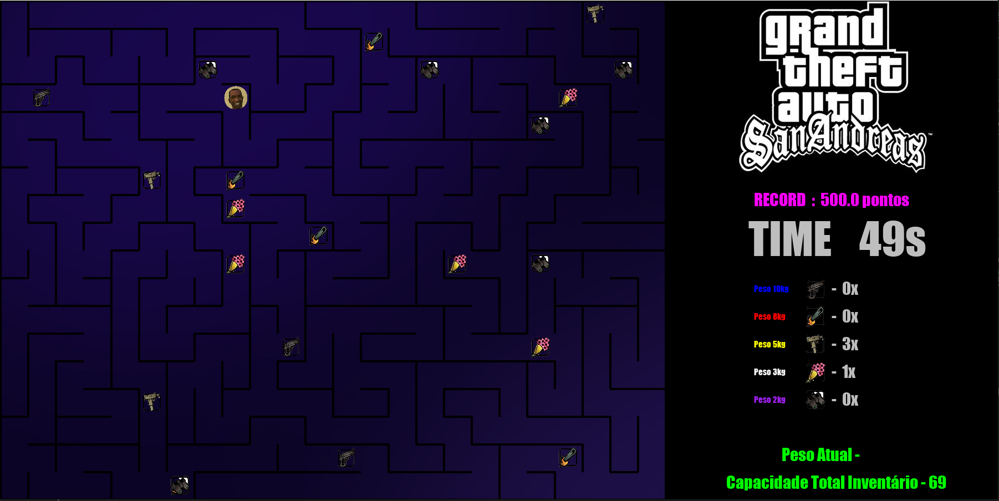
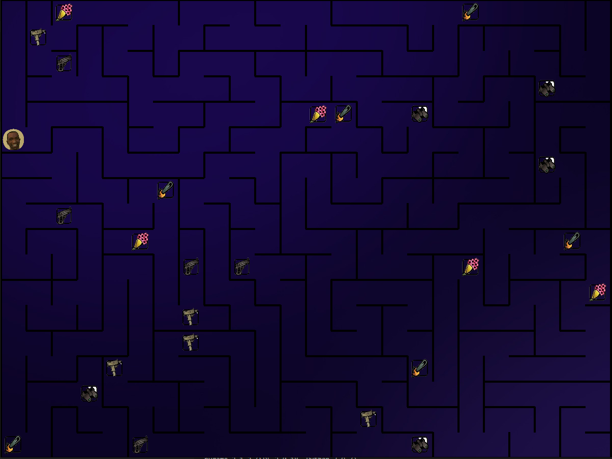

**Final_GtaSan_Maze.** 

# Gta San Maze


## Alunos
|Matrícula | Aluno |
| -- | -- |
| 18/0024868  |  Mateus Moreira Lima |
| 19/0044390  |  Victor Rayan Adriano Ferreira  |

## Sobre 

Ajude o CJ a coletar o valor máximo de itens que vai para seu inventário baseado nos seus pesos. O peso máximo do inventário do CJ é dado, você deve escolher os itens que entraram nela. Percorra o labirinto coletando os itens do mapa, fazendo a melhor combinação possível levando em consideração o peso e o preço do item.

Nosso trabalho utiliza um labirinto gerado randomicamente por uma DFS (Depth First Search) e conceitos da Programação Dinâmica. 

## Screenshots

O jogo:


Mapa do jogo:



Menu do jogo:


## Instalação 
**Linguagem**: Python<br>
**Biblioteca**: Pygame<br>

Para rodar a aplicação é necessário ter instalado em sua máquina o python 3 e o pygame.

### Rode o comando a seguir para baixar o pygame:
```
$ pip install pygame
```
ou
```
$ pip3 install pygame
```

### Para rodar a aplicação certifique de estar dentro da pasta Mapfinder:

Para entrar dentro da pasta GtaSan_Maze

```
$ cd GtaSan_Maze
```

### Rodar a aplicação:
```
$ python game.py
```
ou
```
$ python3 game.py
```


## Uso 
1. Utilize as Teclas W A S D para se locomover pelo labirinto.
2. Colete os itens pensando sempre no valor máximo de itens que vai na mochila baseado no peso. 
3. Caso tenha pego um item mas queira remover do inventário do CJ, aperte 'X' e será removido o último item coletado.
4. Pressione 'V', quando achar que encontrou a melhor combinação para encerrar a partida. Irá aparecer sua pontuação na tela.
5. Ao coletar itens você receberá um pouco mais de tempo para fazer a melhor estratégia para montar um inventário perfeito.
6. Se o tempo acabar, a partida é encerrada e será feito o cálculo da sua pontuação.
7. Seu objetivo é conseguir a maior pontuação possível. 1000 pontos.


